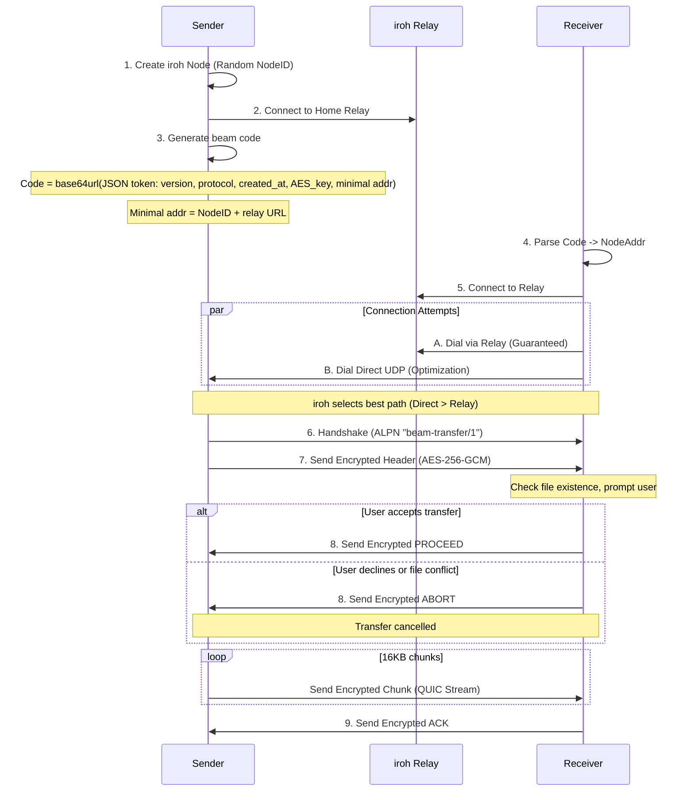
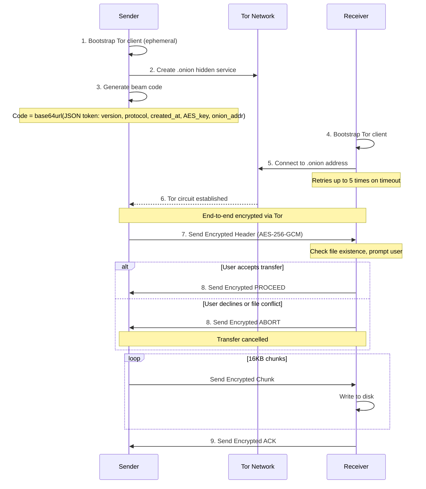
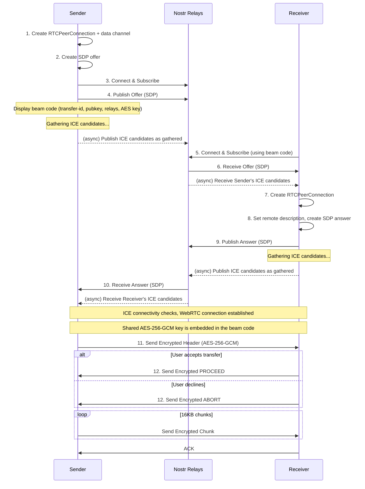
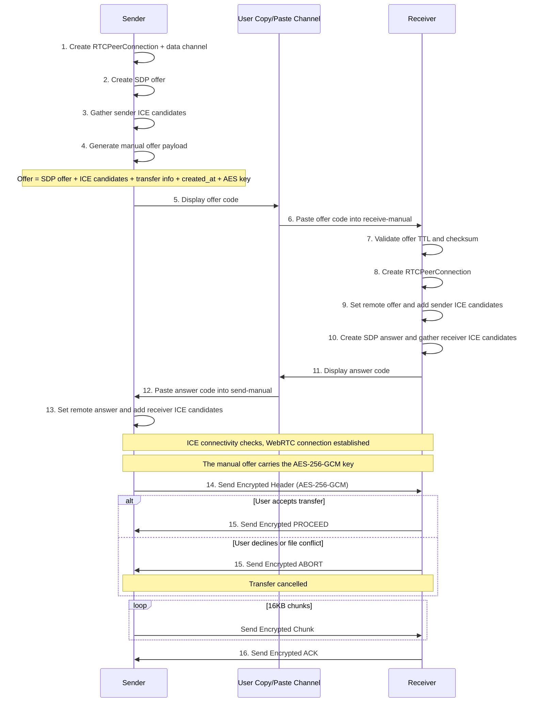
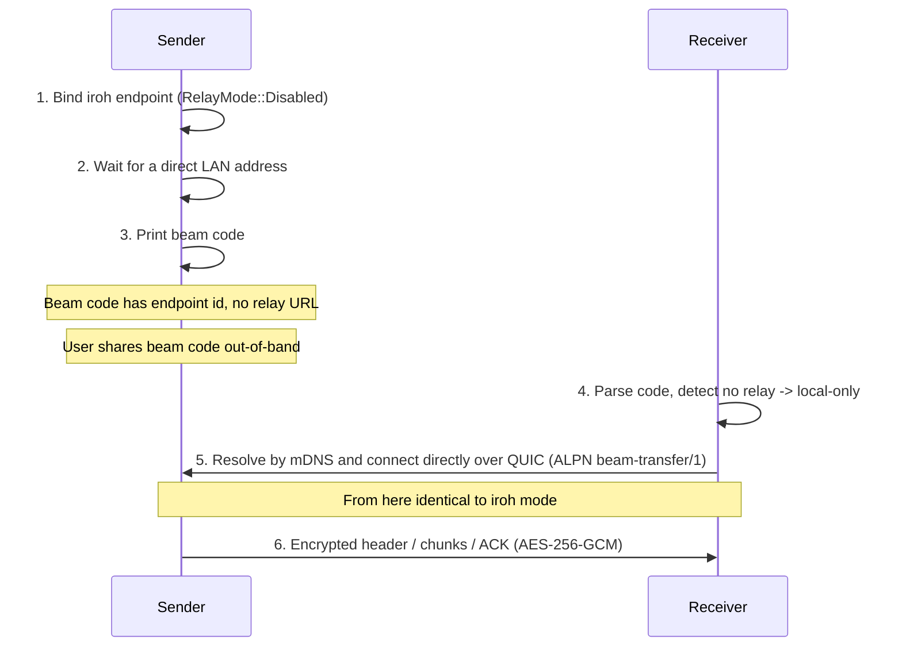

# Beam-rs Architecture

## Overview

This document provides a detailed walkthrough of the beam-rs implementation.

beam-rs supports two main categories of transport:

1. **Internet Transfers** (beam code based):
    - **iroh Mode** (Recommended) - Direct P2P transfers using iroh's QUIC/TLS stack (automatic relay fallback) via `beam-rs send`
    - **Tor Mode**: Anonymous transfers via Tor hidden services (uses `arti`) via `beam-rs-tor send`
    - **WebRTC Mode**: Direct P2P via WebRTC DataChannels with Nostr signaling via `beam-rs-webrtc send`
2. **Local Transfers** (using `beam-rs send --local-only`):
    - **Local-only Mode**: LAN-only transfers using the iroh QUIC/TLS stack with relays disabled; the sender is discovered by mDNS and connected to directly. Uses the same beam code format as iroh mode.

## Transfer Flows

### 1. Internet Transfers (Beam Code)

#### iroh Mode (Recommended) - QUIC / Direct + Relay

iroh uses a "hole punching" strategy that attempts direct connections via UDP/QUIC while simultaneously establishing a fallback path through a Relay (DERP) server.



#### Tor Mode



#### WebRTC Mode



#### WebRTC Manual Mode

Manual WebRTC mode uses the same WebRTC DataChannel transport and encrypted
transfer protocol as Nostr-signaled WebRTC mode, but replaces relay signaling
with two user-copied payloads. The offer contains the SDP offer, sender ICE
candidates, transfer metadata, creation timestamp, and AES key. The answer
contains the SDP answer and receiver ICE candidates.



### 2. Local Transfers (LAN)

#### Local-only Mode (iroh with relays disabled)

Local-only mode is designed for transfers on the same LAN without internet
access. It is the **same** iroh transport and beam code as the default mode,
with one difference: relays are disabled (`RelayMode::Disabled`). The sender
waits for its own LAN addresses so mDNS has something to advertise, then prints
a beam code containing the endpoint ID with no relay URL. The receiver
auto-detects this mode from the missing relay URL and resolves the sender over
mDNS. Local-only endpoints use a DNS resolver that does not read host DNS
configuration, avoiding macOS scoped-resolver parse warnings in relay-free mode.



## Connection Types/Modes

### iroh Mode (`beam-rs send`) - Recommended
- **Transport**: QUIC / TLS 1.3
- **Discovery**: Relay URL embedded in beam code + mDNS for local network.
- **Relay**: iroh relays (DERP) - automatically used if direct P2P connection fails.
- **Failover**: Uses multiple relays for redundancy; monitors latency to select the best path.
- **Connection**: "Hole punching" attempts to establish a direct UDP connection; falls back to relay if NATs are strict.
- **Protocol**: ALPN `beam-transfer/1`.
- **Encryption**: Always AES-256-GCM encrypted at the application layer, plus QUIC/TLS encryption.

### Local-only Mode (`beam-rs send --local-only`)
- **Transport**: QUIC / TLS 1.3 (same as iroh mode)
- **Discovery**: mDNS address lookup; relays disabled (`RelayMode::Disabled`)
- **Key Exchange**: Beam code (carries the AES key and an endpoint address with no relay URL)
- **Encryption**: Always AES-256-GCM at the application layer, plus QUIC/TLS encryption
- **Reachability**: The sender waits for at least one direct address before printing the code so mDNS can advertise it (it cannot wait for a relay, since relays are disabled). Incompatible with `--pin` and `--relay-url`.

### Tor Mode (`beam-rs-tor send`)
- **Transport**: Tor Onion Services
- **Discovery**: Onion Address
- **Encryption**: Tor circuit encryption plus mandatory AES-256-GCM at the application layer.

### WebRTC Mode (`beam-rs-webrtc send`)
- **Transport**: WebRTC DataChannel over DTLS
- **Discovery**: Nostr relays for SDP/ICE signaling (or manual copy-paste)
- **NAT Traversal**: ICE with multiple public STUN servers (Google + Cloudflare)
- **Encryption**: DTLS (WebRTC built-in) + AES-256-GCM at application layer
- **Fallback**: Try iroh mode (with automatic relay) if direct P2P fails. Use `beam-rs-tor` for anonymity

## Security Model

### iroh Mode Encryption (Dual Layer)
iroh mode uses two encryption layers for defense in depth:

**Transport Layer (iroh/QUIC)**:
- TLS 1.3/QUIC encryption (cipher negotiated by iroh/quinn)
- Mutual authentication via iroh node identities (NodeID in beam code)

**Application Layer (beam-rs)**:
- AES-256-GCM encryption for all data: headers, chunks, and control signals
- 256-bit key generated per transfer, embedded in beam code

### WebRTC Mode Encryption (Dual Layer)
WebRTC mode uses two encryption layers for defense in depth:

**Transport Layer (WebRTC/DTLS)**:
- DTLS encryption for all data channel traffic
- ICE consent for periodic connectivity verification

**Application Layer (beam-rs)**:
- AES-256-GCM encryption for all data: headers, chunks, and control signals
- Per-transfer random key embedded in the beam code

### PIN-based Key Exchange (PIN Mode)
PIN mode (`beam-rs send --pin`) exchanges the beam code through Nostr keyed by a short PIN, then runs a SPAKE2 handshake over the iroh stream to derive the session key. It requires internet (Nostr) and is therefore not available with `--local-only`.
- **Format**: 12 characters (11 random + 1 checksum) from an unambiguous charset; the checksum catches typos before attempting a connection.
- **Key Derivation**: The PIN is fed into SPAKE2 (with transfer_id as context) to derive the session key.
- **Security**: SPAKE2 prevents offline dictionary attacks and rejects wrong transfer_id.
- **Confidentiality**: All data (headers, chunks, and control signals) is AES-256-GCM encrypted with the SPAKE2-derived key, on top of the QUIC/TLS transport.

### Tor Mode Security
- **Anonymity**: Sender/Receiver IPs hidden.
- **Encryption**: End-to-end via Tor circuit encryption plus mandatory AES-256-GCM at application layer for all data (headers, chunks, and control signals).

### TTL (Time-To-Live) Validation

All beam codes and signaling offers include a creation timestamp and are validated against a TTL to prevent replay attacks and stale session establishment.

**Implementation:**
- **Token Version**: v4 tokens include a `created_at` Unix timestamp
- **TTL Duration**: 60 minutes (`SESSION_TTL_SECS = 3600`)
- **Clock Skew**: Allows up to 60 seconds into the future to handle minor clock drift

**Validation Points:**
1. **Beam Codes** (iroh, iroh `--local-only`, tor, webrtc via Nostr): Validated in `parse_code()` before connection. Local-only codes use the same v4 token format and are validated the same way.
2. **Manual Signaling Offers** (`send-manual`/`receive-manual` WebRTC): Validated in `read_offer_json()` before WebRTC handshake

**Error Messages:**
- Expired codes: "Token expired: code is X minutes old (max 60 minutes). Please request a new code from the sender."
- Future timestamps: "Invalid token: created_at is in the future. Check system clock."

## Wire Protocol Format

### Encrypted Message Format (Stream-based transports)

All encrypted messages (used by Iroh, iroh `--local-only`, and Tor modes) follow this format:

```
[length: 4 bytes BE][encrypted_payload]
```

- **length**: Big-endian u32 indicating total size of `encrypted_payload`
- **encrypted_payload**: `nonce (12 bytes) || ciphertext || tag (16 bytes)`

### Control Signals

Control signals are encrypted messages sent over the same length-prefixed framing as data:

- **PROCEED**: receiver accepts transfer
- **ABORT**: receiver declines transfer
- **ACK**: receiver confirms all expected bytes were received
- **RESUME:<offset>**: receiver requests resume from a byte offset (files only)

These signals are not tied to chunk numbers and use fresh random nonces like all other encrypted messages.

### Resumable File On-Disk Flow

Resumable state is only used for **file** transfers (not folders) when resume is enabled.

- Receiver writes incoming bytes to a resume temp file in the target directory:
  `<final_path>.beam-rs.partial`
- That temp file contains a fixed-size metadata header (checksum, expected size,
  bytes received, filename) followed by file data.

When the transfer completes successfully:

1. Receiver writes payload bytes (without metadata header) to a staging file:
   `<final_path>.partial` in the same directory.
2. Receiver syncs the staging file and parent directory.
3. Receiver atomically renames staging to the final destination path.
4. Receiver removes `<final_path>.beam-rs.partial`.

Keeping both temp/staging files in the same directory ensures the final rename
is on the same filesystem, which enables atomic replacement semantics.

### WebRTC Message Format

WebRTC uses the same length-prefixed encrypted framing as stream transports. The
`DataChannelStream` adapter bridges WebRTC's `RTCDataChannel` to tokio's
`AsyncRead/AsyncWrite`, so the unified protocol works without special-casing.

### Nonce Derivation

AES-256-GCM requires a unique 12-byte nonce for each encryption operation with
the same key. beam-rs generates a fresh random 96-bit nonce per message and
prefixes it to the ciphertext, so the receiver can decrypt directly. With 16KB
chunks and a per-transfer key, the conservative 2^32 random-nonce limit
corresponds to ~64 TiB per transfer.

### Confirmation Handshake

Before data transfer begins, the receiver validates the incoming transfer:

1. **Sender** sends encrypted file header containing filename, size, and transfer type
2. **Receiver** checks:
   - If file already exists at destination
   - If user wants to proceed (interactive prompt)
3. **Receiver** responds with:
   - **PROCEED**: Accept transfer, sender begins sending data chunks
   - **ABORT**: Decline transfer, connection is closed

This handshake prevents:
- Accidental file overwrites without user consent
- Wasted bandwidth on declined transfers
- Sender continuing after receiver has disconnected
