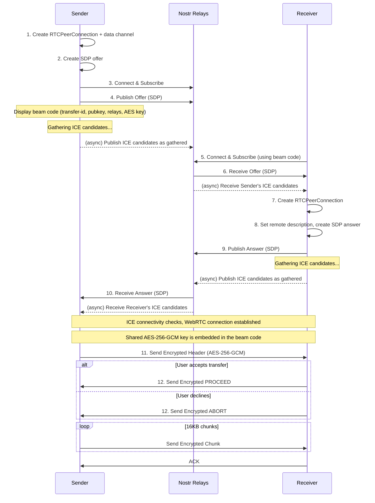
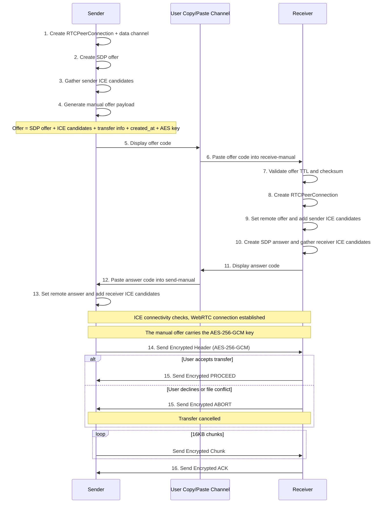

# Beam-rs-webrtc Architecture

## Overview

This document provides a detailed walkthrough of the beam-rs-webrtc
implementation.

beam-rs-webrtc transfers files over a direct WebRTC DataChannel. It supports two
signaling methods for establishing that channel:

1. **Online (Nostr signaling)** — SDP offers/answers and ICE candidates are
   exchanged through Nostr relays via `beam-rs-webrtc send` / `receive`.
2. **Manual (offline signaling)** — the offer and answer payloads are exchanged
   by copy-paste via `beam-rs-webrtc send-manual` / `receive-manual`.

In both cases the file bytes flow directly peer-to-peer; the signaling method
only affects how the two peers find each other and negotiate the connection.

## Transfer Flows

### 1. Online WebRTC Mode (Nostr signaling)



### 2. Manual WebRTC Mode (offline signaling)

Manual mode uses the same WebRTC DataChannel transport and encrypted transfer
protocol as Nostr-signaled mode, but replaces relay signaling with two
user-copied payloads. The offer contains the SDP offer, sender ICE candidates,
transfer metadata, creation timestamp, and AES key. The answer contains the SDP
answer and receiver ICE candidates.



## Connection Modes

### Online WebRTC Mode (`beam-rs-webrtc send`)
- **Transport**: WebRTC DataChannel over DTLS
- **Discovery**: Nostr relays for SDP/ICE signaling (relays auto-discovered, or set with `--relay` / `--default-relays`)
- **NAT Traversal**: ICE with multiple public STUN servers (Google + Cloudflare)
- **Key Exchange**: Beam code (carries the AES key)
- **PIN Support**: Yes (`beam-rs-webrtc send --pin` / `beam-rs-webrtc receive --pin`)
- **Encryption**: DTLS (WebRTC built-in) + AES-256-GCM at application layer

### Manual WebRTC Mode (`beam-rs-webrtc send-manual`)
- **Transport**: WebRTC DataChannel over DTLS
- **Discovery**: Manual copy/paste offer and answer payloads containing SDP and ICE candidates
- **NAT Traversal**: ICE with multiple public STUN servers (Google + Cloudflare)
- **Key Exchange**: Manual offer payload (carries the AES key and must be shared over a trusted channel)
- **PIN Support**: No; manual mode is a two-payload offer/answer exchange and does not use Nostr PIN lookup
- **Encryption**: DTLS (WebRTC built-in) + AES-256-GCM at application layer

## Security Model

### WebRTC Mode Encryption (Dual Layer)
WebRTC mode uses two encryption layers for defense in depth:

**Transport Layer (WebRTC/DTLS)**:
- DTLS encryption for all data channel traffic
- ICE consent for periodic connectivity verification

**Application Layer (beam-rs)**:
- AES-256-GCM encryption for all data: headers, chunks, and control signals
- Per-transfer random key embedded in the beam code (or the manual offer payload)

### PIN-based Key Exchange (PIN Mode)
PIN mode is available for online WebRTC mode (`beam-rs-webrtc send --pin`). It is
not available for manual mode.

PIN mode exchanges the beam code through Nostr keyed by a short PIN, then runs a
SPAKE2 handshake over the established DataChannel to derive the session key. PIN
mode requires internet access for the Nostr lookup.

- **Format**: 12 characters (11 random + 1 checksum) from an unambiguous charset; the checksum catches typos before attempting a connection.
- **Key Derivation**: The PIN is fed into SPAKE2 (with transfer_id as context) to derive the session key.
- **Security**: SPAKE2 prevents offline dictionary attacks and rejects wrong transfer_id.
- **Confidentiality**: All data (headers, chunks, and control signals) is AES-256-GCM encrypted with the SPAKE2-derived key, on top of the DTLS transport encryption.

### TTL (Time-To-Live) Validation

All beam codes and manual signaling offers include a creation timestamp and are
validated against a TTL to prevent replay attacks and stale session
establishment.

**Implementation:**
- **Token Version**: v4 tokens include a `created_at` Unix timestamp
- **TTL Duration**: 60 minutes (`SESSION_TTL_SECS = 3600`)
- **Clock Skew**: Allows up to 60 seconds into the future to handle minor clock drift

**Validation Points:**
1. **Beam Codes** (online WebRTC via Nostr): Validated in `parse_code()` before connection.
2. **Manual Signaling Offers** (`send-manual`/`receive-manual`): Validated in `read_offer_json()` before the WebRTC handshake.

**Error Messages:**
- Expired codes: "Token expired: code is X minutes old (max 60 minutes). Please request a new code from the sender."
- Future timestamps: "Invalid token: created_at is in the future. Check system clock."

## Wire Protocol Format

### Encrypted Message Format

WebRTC uses a length-prefixed encrypted framing. The `DataChannelStream` adapter
bridges WebRTC's `RTCDataChannel` to tokio's `AsyncRead/AsyncWrite`, so the
transfer protocol works over the data channel like any byte stream.

```
[length: 4 bytes BE][encrypted_payload]
```

- **length**: Big-endian u32 indicating total size of `encrypted_payload`
- **encrypted_payload**: `nonce (12 bytes) || ciphertext || tag (16 bytes)`

### Control Signals

Control signals are encrypted messages sent over the same length-prefixed framing as data:

- **PROCEED**: receiver accepts transfer
- **ABORT**: receiver declines transfer
- **ACK**: receiver confirms all expected bytes were received
- **RESUME:<offset>**: receiver requests resume from a byte offset (files only)

These signals are not tied to chunk numbers and use fresh random nonces like all other encrypted messages.

### Resumable File On-Disk Flow

Resumable state is only used for **file** transfers (not folders) when resume is enabled.

- Receiver writes incoming bytes to a resume temp file in the target directory:
  `<final_path>.beam-rs.partial`
- That temp file contains a fixed-size metadata header (checksum, expected size,
  bytes received, filename) followed by file data.

When the transfer completes successfully:

1. Receiver writes payload bytes (without metadata header) to a staging file:
   `<final_path>.partial` in the same directory.
2. Receiver syncs the staging file and parent directory.
3. Receiver atomically renames staging to the final destination path.
4. Receiver removes `<final_path>.beam-rs.partial`.

Keeping both temp/staging files in the same directory ensures the final rename
is on the same filesystem, which enables atomic replacement semantics.

### Nonce Derivation

AES-256-GCM requires a unique 12-byte nonce for each encryption operation with
the same key. beam-rs generates a fresh random 96-bit nonce per message and
prefixes it to the ciphertext, so the receiver can decrypt directly. With 16KB
chunks and a per-transfer key, the conservative 2^32 random-nonce limit
corresponds to ~64 TiB per transfer.

### Confirmation Handshake

Before data transfer begins, the receiver validates the incoming transfer:

1. **Sender** sends encrypted file header containing filename, size, and transfer type
2. **Receiver** checks:
   - If file already exists at destination
   - If user wants to proceed (interactive prompt)
3. **Receiver** responds with:
   - **PROCEED**: Accept transfer, sender begins sending data chunks
   - **ABORT**: Decline transfer, connection is closed

This handshake prevents:
- Accidental file overwrites without user consent
- Wasted bandwidth on declined transfers
- Sender continuing after receiver has disconnected
```
