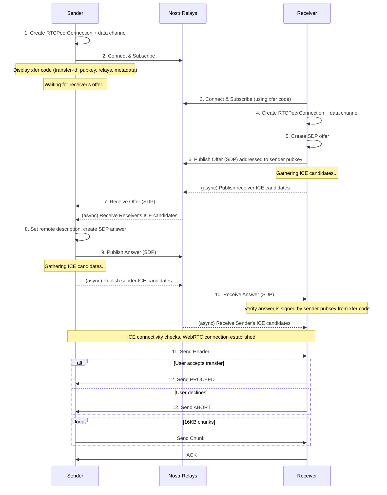
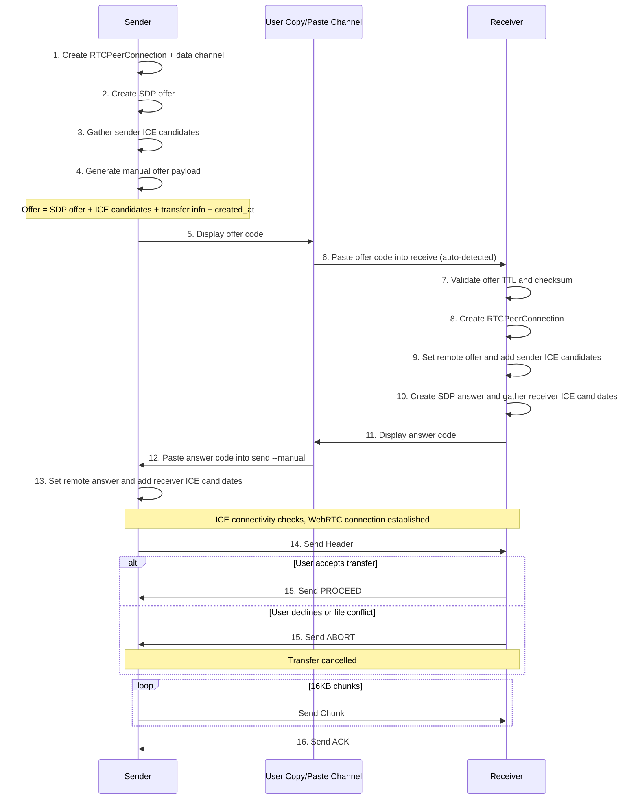

# Xfer-webrtc Architecture

## Overview

This document provides a detailed walkthrough of the xfer-webrtc
implementation.

xfer-webrtc transfers files over a direct WebRTC DataChannel. It supports two
signaling methods for establishing that channel:

1. **Online (Nostr signaling)** — SDP offers/answers and ICE candidates are
   exchanged through Nostr relays via `xfer-webrtc send` / `receive`.
2. **Manual (offline signaling)** — the offer and answer payloads are exchanged
   by copy-paste via `xfer-webrtc send --manual`; the receiver uses the same
   `xfer-webrtc receive`, which auto-detects a pasted manual offer.

In both cases the file bytes flow directly peer-to-peer; the signaling method
only affects how the two peers find each other and negotiate the connection.

## Transfer Flows

### 1. Online WebRTC Mode (Nostr signaling)



### 2. Manual WebRTC Mode (offline signaling)

Manual mode uses the same WebRTC DataChannel transport and transfer protocol as
Nostr-signaled mode, but replaces relay signaling with two
user-copied payloads. The offer contains the SDP offer, sender ICE candidates,
transfer metadata, and creation timestamp. The answer contains the SDP answer
and receiver ICE candidates.



## Connection Modes

### Online WebRTC Mode (`xfer-webrtc send`)
- **Transport**: WebRTC DataChannel over DTLS
- **Discovery**: Nostr relays for SDP/ICE signaling (relays auto-discovered, or custom relay URLs specified with repeatable `--relay`)
- **NAT Traversal**: ICE with multiple public STUN servers (Google + Cloudflare)
- **Xfer Code**: Transfer ID, sender pubkey, relays, and file metadata
- **Encryption**: DTLS (WebRTC built-in)

### Manual WebRTC Mode (`xfer-webrtc send --manual`)
- **Transport**: WebRTC DataChannel over DTLS
- **Discovery**: Manual copy/paste offer and answer payloads containing SDP and ICE candidates
- **NAT Traversal**: ICE with multiple public STUN servers (Google + Cloudflare)
- **Offer Payload**: SDP, ICE candidates, file metadata, and creation timestamp
- **Encryption**: DTLS (WebRTC built-in)

## Security Model

### WebRTC Mode Encryption

**Transport Layer (WebRTC/DTLS)**:
- DTLS encryption for all data channel traffic
- ICE consent for periodic connectivity verification

### Signaling Authentication (online mode)

Nostr events are signed by their author's key. The xfer code carries the
sender's pubkey, so the receiver authenticates the SDP answer by requiring its
event pubkey to equal the sender pubkey from the xfer code
(`src/webrtc/receiver.rs`). Answers signed by any other key are ignored. This
prevents an attacker who learns the transfer ID and receiver pubkey from relay
traffic from racing a forged answer.

The receiver's signaling key is ephemeral and not known to the sender ahead of
time, so the sender cannot authenticate the offer pubkey; it accepts the first
valid offer for its transfer ID. The DTLS handshake still establishes an
encrypted channel between whichever two peers complete ICE.

### TTL (Time-To-Live) Validation

All xfer codes and manual signaling offers include a creation timestamp and are
validated against a TTL to limit staleness — they are rejected once older than
the TTL. This bounds the window in which a leaked code or offer is usable; it is
not full replay protection, since there is no one-time-use/nonce-consumption
cache, so a valid code or offer can be reused any number of times within the
TTL.

**Implementation:**
- **Token Version**: v5 tokens include a `created_at` Unix timestamp
- **TTL Duration**: 60 minutes (`SESSION_TTL_SECS = 3600`)
- **Clock Skew**: Allows up to 60 seconds into the future to handle minor clock drift

**Validation Points:**
1. **Xfer Codes** (online WebRTC via Nostr): Validated in `parse_code()` before connection.
2. **Manual Signaling Offers** (`send --manual` / `receive`): Validated in `read_code_or_offer()` before the WebRTC handshake.

**Error Messages:**
- Expired codes: "Token expired: code is X minutes old (max 60 minutes). Please request a new code from the sender."
- Future timestamps: "Invalid token: created_at is in the future. Check system clock."

## Wire Protocol Format

### Message Format

WebRTC uses length-prefixed framing over the encrypted DataChannel. The
`DataChannelStream` adapter bridges WebRTC's `RTCDataChannel` to tokio's
`AsyncRead/AsyncWrite`, so the transfer protocol works over the data channel
like any byte stream.

```
[length: 4 bytes BE][payload]
```

- **length**: Big-endian u32 indicating total size of `payload`
- **payload**: Serialized header bytes, file chunk bytes, or control signal bytes

### Control Signals

Control signals are sent over the same length-prefixed framing as data:

- **PROCEED**: receiver accepts transfer
- **ABORT**: receiver declines transfer
- **ACK**: receiver confirms all expected bytes were received
- **RESUME:<offset>**: receiver requests resume from a byte offset (files only)

### Resumable File On-Disk Flow

Resumable state is only used for **file** transfers (not folders) when resume is enabled.

- Receiver writes incoming bytes to a resume temp file in the target directory:
  `<final_path>.xfer.partial`
- That temp file contains a fixed-size metadata header (checksum, expected size,
  bytes received, filename) followed by file data.

When the transfer completes successfully:

1. Receiver writes payload bytes (without metadata header) to a staging file:
   `<final_path>.partial` in the same directory.
2. Receiver syncs the staging file and parent directory.
3. Receiver atomically renames staging to the final destination path.
4. Receiver removes `<final_path>.xfer.partial`.

Keeping both temp/staging files in the same directory ensures the final rename
is on the same filesystem, which enables atomic replacement semantics.

### Confirmation Handshake

Before data transfer begins, the receiver validates the incoming transfer:

1. **Sender** sends file header containing filename, size, and transfer type
2. **Receiver** checks:
   - If file already exists at destination
   - If user wants to proceed (interactive prompt)
3. **Receiver** responds with:
   - **PROCEED**: Accept transfer, sender begins sending data chunks
   - **ABORT**: Decline transfer, connection is closed

This handshake prevents:
- Accidental file overwrites without user consent
- Wasted bandwidth on declined transfers
- Sender continuing after receiver has disconnected
